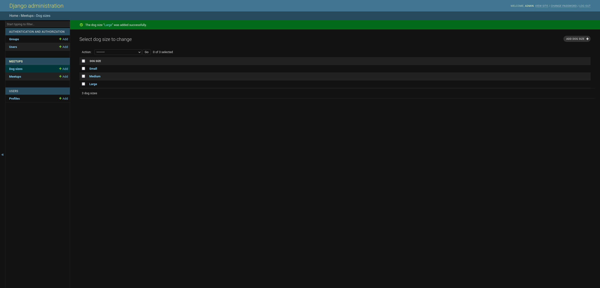
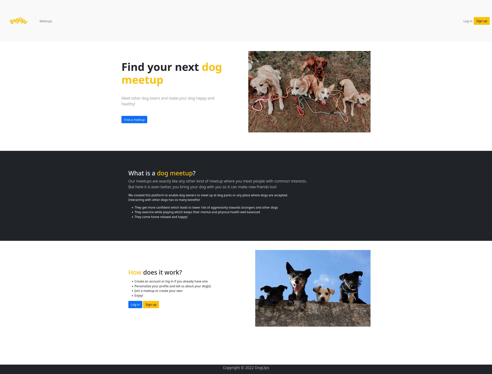
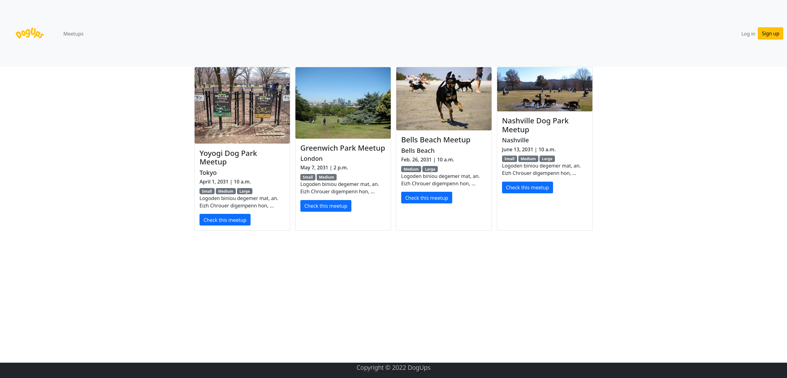
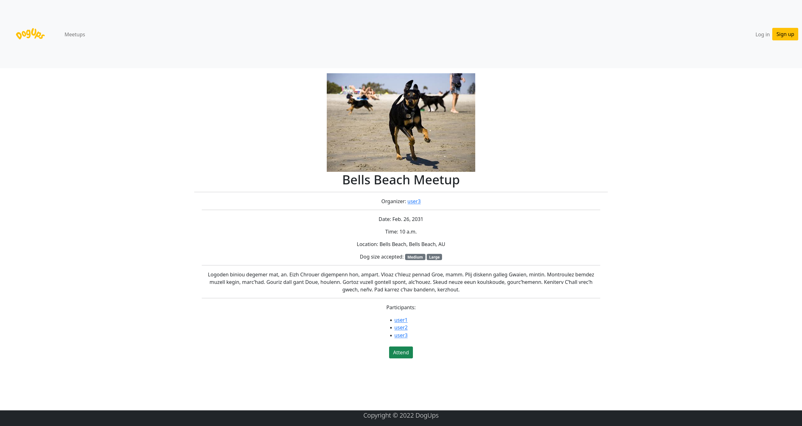
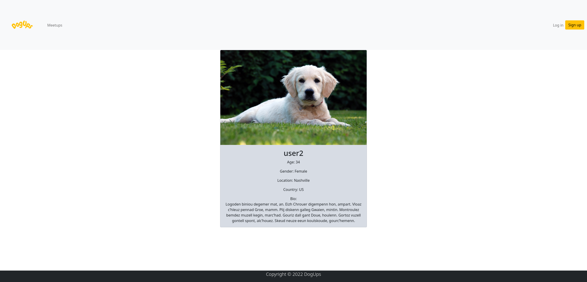
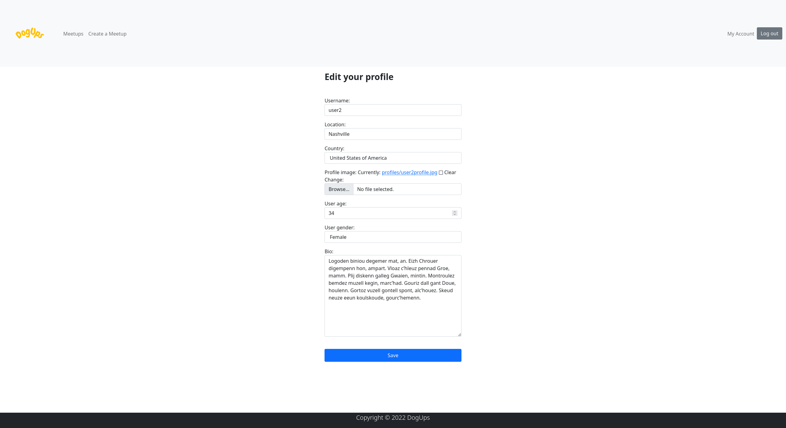
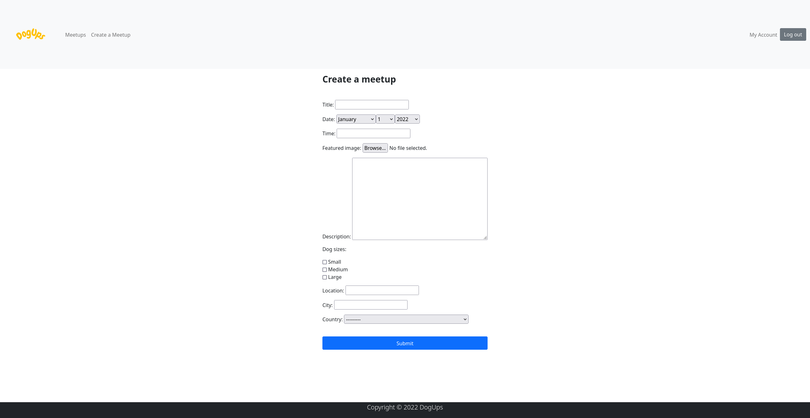
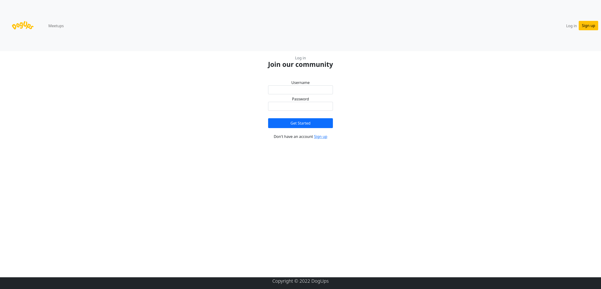
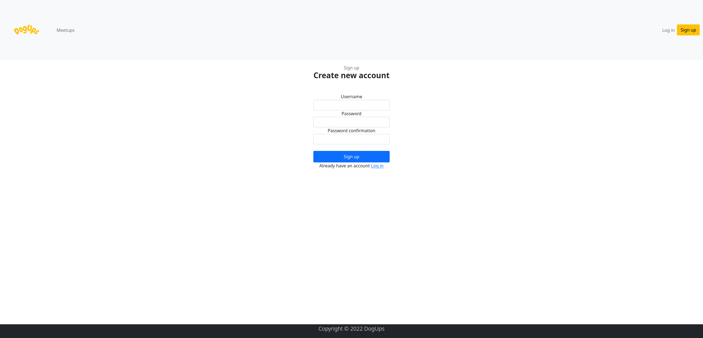

# Introduction

A platform for dog owners to organize and join meetups around the world.

# Features

- Create, attend a meetup or cancel your participation to a meetup
- Specify which size(s) of dogs are accepted to the meetup : Small, Medium, Large.
- Edit your profile

# Technologies used

- Django
- SQLite3
- Bootstrap 5

# Prerequisites

You must have Python 3 installed on your computer. Here is a good tutorial on how to install it:
https://realpython.com/installing-python/

# Installation

Clone this repository.
```bash
git clone https://github.com/kaluba-dev/dogups.git
```
Create a python virtual environment in the project root directory (where manage.py is located).
```bash
# Linux and macOS
python3 -m venv your_virtual_environment_name
# Windows
py -m venv venv your_virtual_environment_name
```
Activate the virtual environment.
```bash
# Linux and macOS
source your_virtual_environment_name/bin/activate
# Windows
.\your_virtual_environment_name\Scripts\activate
```
Install all the packages required (listed in requirements.txt).
```bash
pip install -r requirements.txt
```
Run the migrations in order to create the database.
```bash
python manage.py makemigrations
python manage.py migrate
```
Create an admin user to manage the website.
```bash
python manage.py createsuperuser
```
Run the server.
```bash
python manage.py runserver
```
Go to the admin page and log in using your admin credentials.
```bash
http://127.0.0.1:8000/admin/
```
Click on "Add" next to "Dog Sizes" under "MEETUPS" and add the following in **this** order:
- Small
- Medium
- Large

The "Dog Sizes" section should now look like this:



Create a media folder in the project root directory (where manage.py is located) and add two folders inside the media folder: 
- meetups
- profiles

You can now add the meetup default image "img-default.jpg" in "meetups" and the user profile default image "user-default.jpg" in "profiles". These two images are available in the folder "resources". You can also use your own images if you prefer!

Your folder structure should now look similar to this:
```bash
DOGUPS
│   dogups
│   env
└───media
│   │
│   └───meetups
│   │   │   img-default.jpg
│   └───profiles
│       │   user-default.jpg
│   meetups
│   resources (you will not need this folder afterwards)
│   static
│   templates
│   users
│   db.sqlite3
│   manage.py
│   README.md
│   requirements.txt
```

**Good job on setting up the project! Now you can add users and create meetups to test it out.**


# Screenshots

## Home



## Meetups



## Meetup



## User profile



## Edit account



## Create meetup



## Log in 



## Sign up


